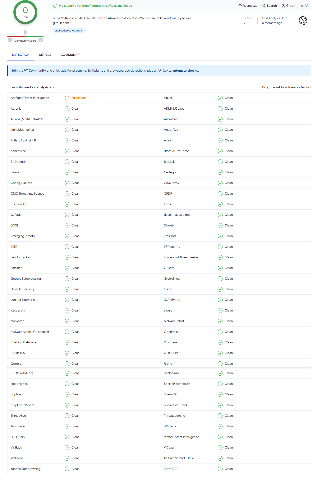

# TorrentLAN

- A Torrent application to be used in Intranet
- Now you can download files with GBps speed, the only limitation is your computer's hardware

---

## Privacy & Concern

- We don't ask any of your personal information
- If you think our program can be malicious so you can yourself scan with a antivirus
- We have also uploaded the results of our scan from multiple antivirus, It is present at the place where you download the installer, below are the scan results of the latest version of our Executables

- The sudo/root permission we are asking is just to add python script in (cron jobs/task sheduler) and (create shorcut if OS==windows), you can confirm the same in [intall.py](./install.py) file, if you are still not convinced then you can see that in [intall.py](./install.py) from line around "529" to "551" you can see that there are some functions named with daemons, these are the functions requiring privilege, so you can manually create cronjobs for these functions , after that remove the privilage restriction inside `__name__=='__main__` and then run the script. Additionally if you are an windows user then you must also make sure that every fxn calling `INSTALL.WINDOWS.create_shortcut` which creates shortcut you should make that shortcut manually
- You might encounter a firewall permission something like below **(you have to select both private and public as shown in image)** *{For those who want to know what this permission means-: When you connect to Wifi you might know that the connection is defined as private or public, so if the network on which server is connected is set as public in your pc, then only allowing permission on private network won't make TorrentLAN work properly}*

---

## Installation Guide

### Windows

- Goto [Windows_Installer](https://github.com/AI-Arsenals/TorrentLAN/releases/tag/Windows)
- Find the latest version (which is not beta) and inside '*assets*' click on `Windows_installer.exe` to download it
- If firewall permission is asked in later process the click allow, check the last point in [Privacy & Concern](#privacy--concern) for more info on this
- It is possible that the antivirus might block the installation, so you can make it to allow it, as it is safe as evident from the scan results in [Privacy & Concern](#privacy--concern)
- Now run `vx.x.x_Windows.exe` , (It is preferable if u open a terminal there and through that run ./vx.x.x_Windows.exe)
- The shortcut of the application will be created on Desktop, you will also see a folder shortcut TorrentLAN, inside this folder go to Normal folder, there u can see the contents uploaded and downloaded by you

### Linux

- Goto [Linux_Installer](https://github.com/AI-Arsenals/TorrentLAN/releases/tag/Windows)
- Find the latest version (which is not beta) and inside '*assets*' click on `Linux_installer.bin` to download it
- If firewall permission is asked in later process, then check the last point in [Privacy & Concern](#privacy--concern)
- Open terminal and change to the directory where the .bin file is downloaded
- Run the downloaded .bin with sudo eg- `sudo ./TorrentLAN-1.0.0.bin` then press enter
- You can see all your data in `Documents/TorrentLAN` folder
- Now you can use the TorrentLAN application from start menu and desktop shortcut

### Mac

- A installation executable is not yet available for Mac yet but u can still use in mac by following below procedute
- You must have python and nodejs installed on your computer
- Clone the repository or download it in zip format and extract it
- If firewall permission is asked in later process, then check the last point in [Privacy & Concern](#privacy--concern)
- Change directory to the folder TorrentLAN
- run `pip install -r requirements.txt` (people who understand `env` can also go that way otherwise it is not needed)
- run `python ./utils/identity/main.py`
- change to `./my-app` directory
- run `npm install` (this will download about 500MB of data) 
- Change directory to the folder TorrentLAN(i.e. base directory where you have downloaded TorrentLAN)
- run `python ./no_install_launch.py`

### Advanced Options

- To manually upload a file you can goto Documents/TorrentLAN/Normal there inside the folder you can either paste it, if you don't want to paste then just create symlink using python os.symlink()
- You can goto configs folder inside TorrentLAN, and check setting yourself

---

## Developer Guide

### Windows & Linux & Mac

- Clone the repository
- You must have python and nodejs installed on your computer
- Open terminal and change to the directory where the repository is cloned or extracted
- run `pip install -r requirements.txt` (people who understand `env` can also go that way otherwise it is not needed)
- delete folders `data` and `configs` and copy folders `data` and `configs` from `./default`
- run `python ./utils/identity/main.py`
- change to `./my-app` directory
- run `npm install` (this will download about 500MB of data)
- Change directory to the folder TorrentLAN(i.e. base directory where you have downloaded TorrentLAN)
- After the above setup any command you run should be from TorrentLAN base directory otherwise it will not work
- All the fxns of backend are available with details in `main.py`
- For People who are outside of (IITJ college) should follow [Outside IITJ College Guide](#outside-iitj-college-guide)

---

## Outside IITJ College Guide

- This guide is for people who are outside (IITJ college)
- TorrentLAN uses server-client tracker model, So u must setup a computer which will act as a tracker server
- In the server you should run `./utils/tracker/server(c-s).py`
- For the clients, change the 'server_addr' to your server address inside `./configs/server.json`
